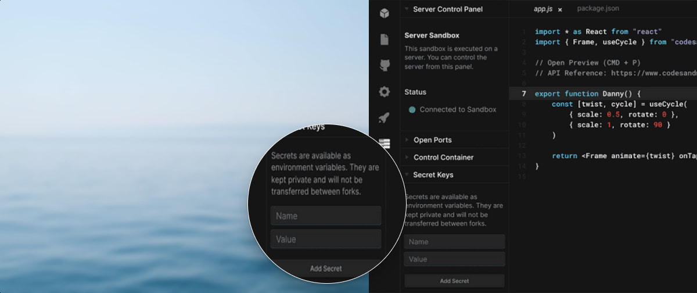

import { Tabs, WrapContent } from '../../../../../shared-components/Tabs'

# Secrets

<Tabs tabs={["Browser", "Cloud"]}>
    <WrapContent>
      ## What are secrets?

Secrets are used to hide sensitive information in your application that you
don't want the world to see, like passwords and API keys. They're implemented in
CodeSandbox using environment variables.

Secrets are not transferred between forks and **can only be used in container
sandboxes**.

## Adding secrets

You can add secrets in a container sandbox from the Server Control Panel. Before
adding any, it should look like this:

Let's say you want to add a Google Maps API key. You can do it like so:

Pro tip: It's good practice to name your secrets all in uppercase.

After clicking the "Add Secret" button the secret is added, the sandbox is
restarted, and you can see the list of all your secrets above the form.

Secrets are environment variables, meaning they are defined on `process.env`. In
the example above, we can read the API key from
`process.env.GOOGLE_MAPS_API_KEY`. See the example below, showing how to access
secrets in your server-side code (though obviously you wouldn't want to share a
secret like this, it justs illustrates how to access them).

https://codesandbox.io/s/broken-resonance-35lyl?codemirror=1&fontsize=14&hidenavigation=1&theme=dark

## Editing secrets

You can edit and remove existing secrets. Click on the pencil to edit the name
and value of your secret.

Once saved, this will take effect automatically, restarting your sandbox to make
sure we use the new value.

To delete you can click on the `x` icon. This will also restart your sandbox.
    </WrapContent>
    <WrapContent>
       Secrets on Cloud Sandboxes are handled in the same way as Repositories. [Read more here](/learn/repositories/secrets)
    </WrapContent>
</Tabs>
